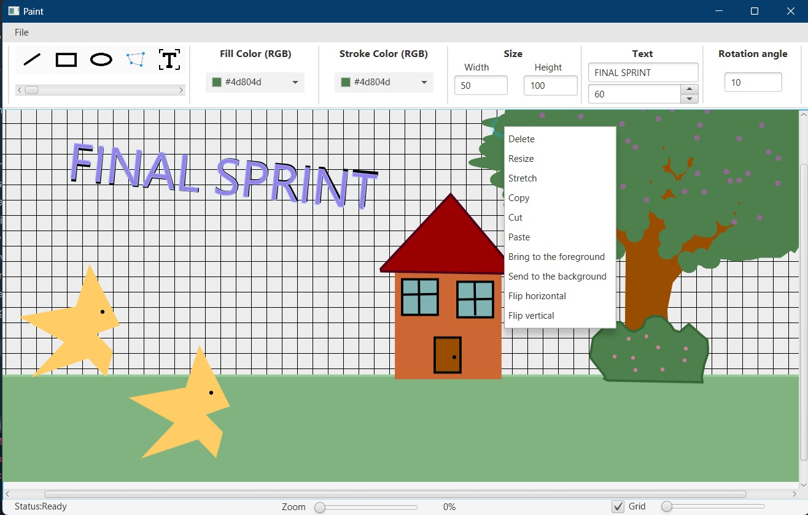

# 🧩 GeoDraw Application: A Modular JavaFX Framework for Geometric Shape Manipulation

## 🎯 Project Overview
**GeoDraw** is a modular application built with **JavaFX**, designed for **geometric shape creation, manipulation, and management** through an interactive user interface.  
The project emphasizes **extensibility, maintainability, and usability**, adopting a layered architecture and widely recognized software design patterns.  
Development follows **Agile/Scrum methodologies**, ensuring iterative delivery and traceability of artifacts.

---

## 🖼️ Application Preview
Below is a preview of the initial application screen:

---

## 📚 Documentation
Comprehensive documentation is available in the [`docs/`](./docs/) directory. Key resources include:

- 🛠️ [**Tool Setup**](./docs/tool_setup.md): Development environment configuration, including:
  - GitHub repository access and structure
  - Trello board integration for Scrum project management
  - Shared Excel document for Product Backlog and Sprint Backlog
  - Technologies and tools adopted: **JavaFX**, **IntelliJ IDEA**, **Maven**, **JDK 21**, **SceneBuilder**, **JUnit**

- 🏗️ [**System Architecture**](./docs/design_document.md): Detailed description of the software architecture, including:
  - Justification of the selected **system architecture**
  - Overview of **main system components**
  - **UML class diagram** providing a high-level structural view
  - Identification of **design patterns** applied within the system

- 📋 [**Scrum & Agile Documentation**](./docs/scrum): Agile process artifacts, including sprint planning, backlog tracking, and progress reports
