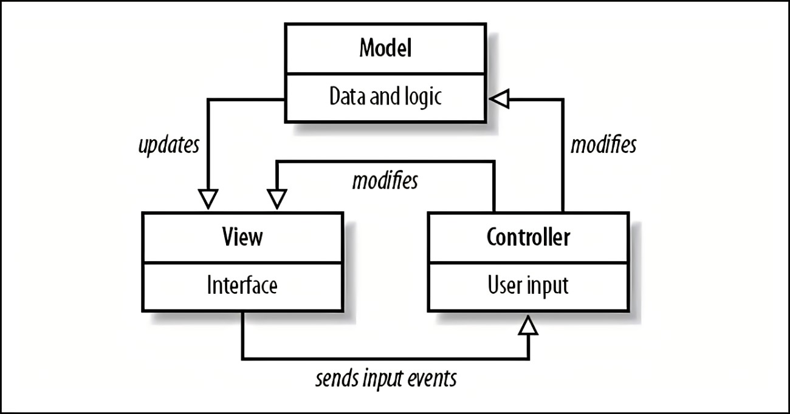
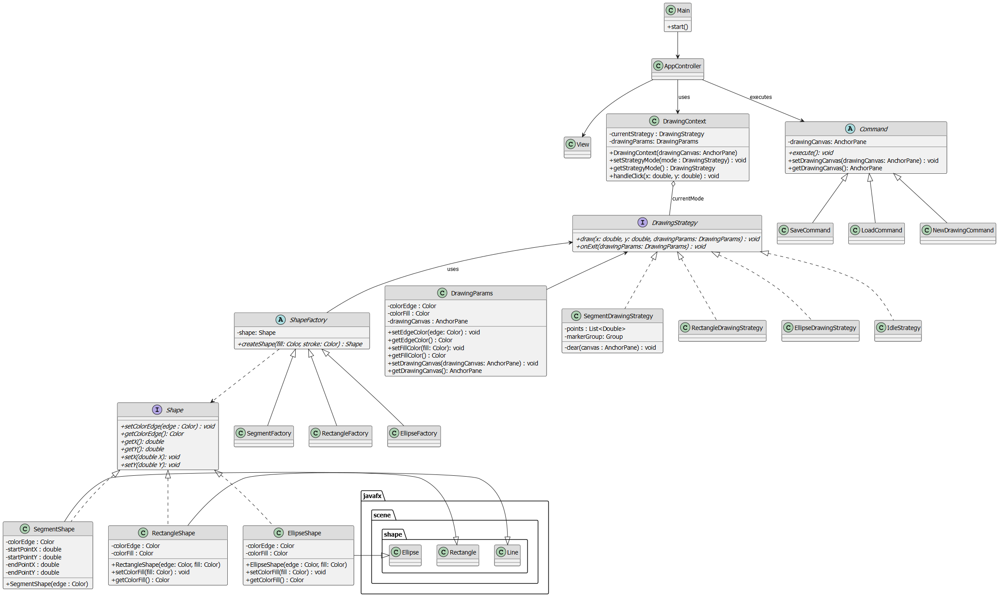

# Documento di Design 

## 1. Introduzione

Questo documento fornisce una panoramica dell’architettura software e del class diagram ad alto livello usati per lo sviluppo di un’app di disegno in Java. Serve a condividere la struttura generale del sistema con il team.

---

## 2. Architettura Software Adottata

### 2.1 Scelta dell’Architettura

Il sistema implementa il pattern *Model-View-Controller (MVC)*, una soluzione ampiamente riconosciuta per garantire separazione delle responsabilità, modularità e manutenibilità del codice.

- **Model**  
  Gestisce i dati e lo stato dell’applicazione, definisce la logica di business ed è completamente indipendente dalla View e dal Controller. Fornisce interfacce per la manipolazione e l’accesso allo stato, sfruttando meccanismi di notifica verso gli oggetti osservatori.

- **View**  
  Responsabile della presentazione grafica del modello in modo user-friendly. Visualizza le informazioni provenienti dal Model senza conoscere la logica di aggiornamento.

- **Controller**  
  Gestisce l’interazione dell’utente, riceve input dalla View e attiva le operazioni appropriate nel Model.

### 2.2 Vantaggi dell’Architettura MVC

- **Basso accoppiamento tra componenti**:
  - Il Model può evolvere senza impatti diretti sulla View e viceversa.
  - Possono essere sviluppate molteplici View per un unico Model.
  - Favorisce il riutilizzo del Model su più piattaforme.
  - Favorisce lo sviluppo in parallelo tra i vari membri del team.

---

## 3. Diagramma Architetturale

---

## 4. Componenti dell’Architettura

### 4.1 Model

Il *Model* comprende:
- Le entità relative alle forme (rettangoli, ellissi, segmenti, poligoni).
- Le varie proprietà delle forme (colore bordo, colore riempimento).
- Le operazioni effettuate: aggiunta, modifica, eliminazione, salvataggio, caricamento ecc.

### 4.2 View

La *View* include:
- L’area di disegno
- Pannelli con selettori di forme e colori
- Toolbar per comandi (salva, carica, annulla, zoom, ecc.)

### 4.3 Controller

Il *Controller* implementa:
- La gestione delle operazioni utente
- L’inoltro degli input dalla View al Model
- La coordinazione tra la logica applicativa e la presentazione visiva

---

## 5. Class Diagram e descrizione
 

Il diagramma delle classi fornisce una vista ad alto livello dell’organizzazione delle principali componenti del sistema. Non entra troppo nel dettaglio, ma ci aiuta a capire come sono strutturate le classi e quali pattern abbiamo deciso di adottare per gestire la complessità.

- **Strategy Pattern**  
  Utilizzato nel contesto del disegno per rappresentare le diverse modalità operative dell’applicazione (disegno di segmenti, rettangoli, ellissi). La classe `DrawingContext` mantiene un riferimento alla strategia corrente (`DrawingMode`), delegando ad essa la gestione degli eventi.

- **Factory Method Pattern**  
  Ogni tipo di forma geometrica viene creata tramite una factory dedicata (`SegmentFactory`, `RectangleFactory`, `EllipseFactory`) che eredita da una classe astratta comune (`ShapeFactory`). Questo pattern consente di disaccoppiare la logica di creazione delle forme dal loro utilizzo.

- **Command Pattern**  
  Le azioni principali come salvataggio, caricamento e creazione di un nuovo disegno sono modellate come comandi (`SaveCommand`, `LoadCommand`, `NewDrawingCommand`) che implementano una comune interfaccia `Command`. Il controller funge da invoker, eseguendo dinamicamente i comandi.

